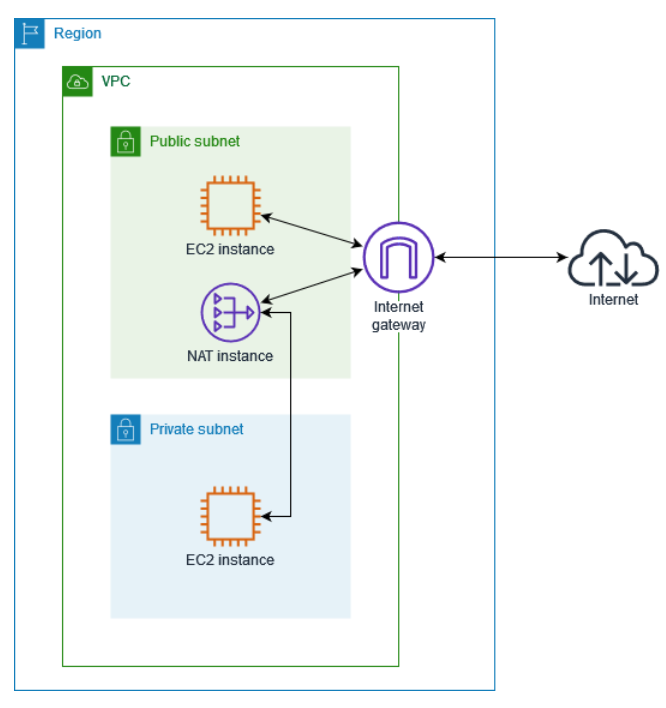

# Configure a VPC with Private Subnets and a NAT Gateway

This project demonstrates how to configure an **Amazon VPC** with public and private subnets, and enable outbound internet access for private instances using a **NAT Gateway**.  

---
## Architecture

  

---

## Tools & Services
- **Amazon VPC** – Custom virtual network.  
- **Subnets** – Public and private across multiple Availability Zones.  
- **Internet Gateway (IGW)** – Provides internet access to public subnets.  
- **NAT Gateway** – Allows private instances to initiate outbound internet traffic.  
- **Route Tables** – Control routing between subnets and gateways.  
- **Elastic IP** – Assigned to the NAT Gateway.  
- **EC2 Instances** – Deployed in both public and private subnets.  
- **Security Groups & NACLs** – Network-level security.  

---

## Features
- Segregation of **public and private subnets**.  
- Outbound internet connectivity for **private subnet instances** via NAT Gateway.  
- **No inbound internet traffic** allowed to private instances.  
- Configurable **security groups and NACLs** for access control.  
- Scalable design – supports **multi-AZ and auto scaling** for resiliency.  

---

## Deployment Steps (High-Level)
1. **Provision VPC** with CIDR block (e.g., `10.0.0.0/16`).  
2. **Create Subnets** – Public and Private across multiple AZs.  
3. **Attach Internet Gateway (IGW)** to the VPC.  
4. **Create NAT Gateway** in the public subnet with an Elastic IP.  
5. **Configure Route Tables** –  
   - Public route table → IGW.  
   - Private route table → NAT Gateway.  
6. **Launch EC2 Instances** –  
   - Public subnet: Bastion host / jump server.  
   - Private subnet: Application servers.  
7. **Apply Security Groups & NACLs** for secure access.  
8. **Test Connectivity** – Private instances reach the internet via NAT.  

---

## Outcome
- Private subnet instances can access the internet for updates, patches, and external services.  
- Inbound traffic from the internet is **blocked** for private subnet instances.  
- Public instances (e.g., Bastion host) remain directly accessible via IGW.  

---

## Documentation
For the technical step-by-step setup guide, see [SETUP](SETUP.md). 

---

## Key Notes
- NAT Gateway must be deployed in a **public subnet** with a route to the IGW.  
- Each NAT Gateway is tied to a specific Availability Zone. For HA, deploy **multiple NAT Gateways** (one per AZ).  
- Outbound traffic is allowed, inbound traffic is blocked unless initiated by private instances.   
- **Cost Awareness** – NAT Gateways incur **hourly charges** and **per-GB data processing charges**. Always clean up resources when not in use.  
